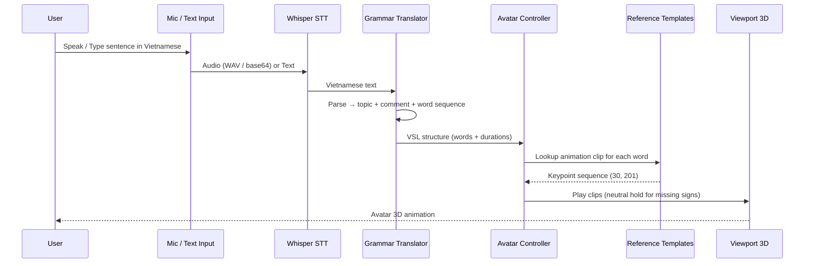
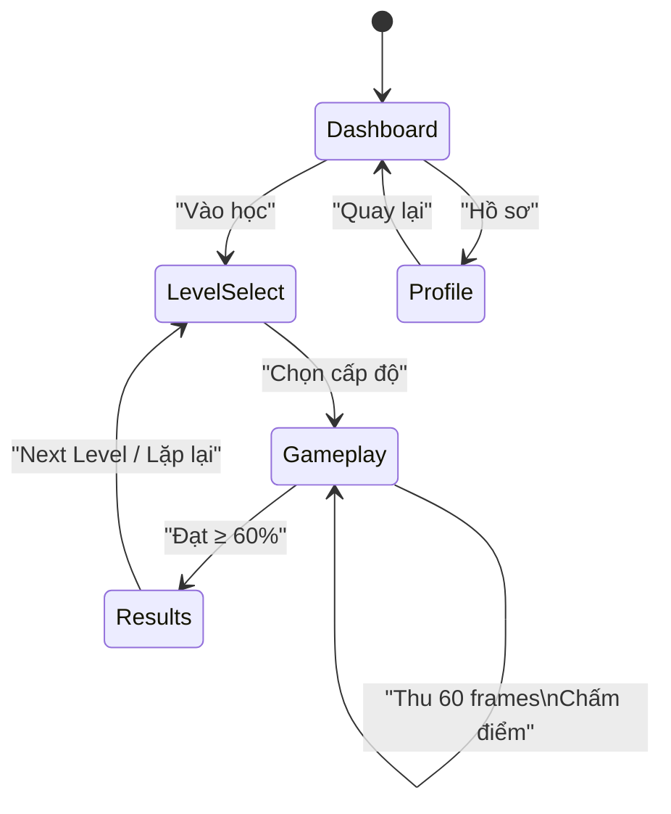
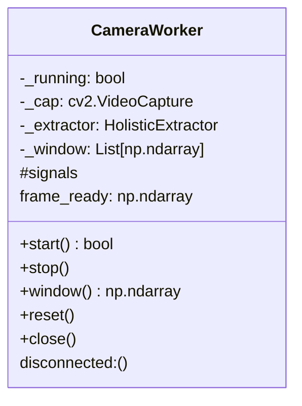

# VSL Ecosystem / Hệ sinh thái VSL

**Vietnamese Sign Language Translation System / Hệ thống dịch Ngôn ngữ Ký hiệu Việt Nam**

A local-first, open-source ecosystem for Vietnamese Sign Language (VSL) on desktop Linux.

| Part | Description / Mô tả | Directory | Interface |
|------|---------------------|-----------|-----------|
| **Part 1** | Isolated sign classification (3315 words) from 201-dim keypoints | `part1-sign-classifier/` | CLI / Python API |
| **Part 2** | Speech → Sign: talk to a 3D avatar that signs back | `part2-speech-to-sign/` | PyQt6 + FastAPI |
| **Part 3** | Gamified learning: practice signs via webcam, earn stars | `part3-gamification/` | PyQt6 + FastAPI |
| **Shared** | Common library (`vslshared`) — keypoints, vocab, templates, classifier | `shared/vslshared/` | Python package |

> **No 3D assets required.** The keypoint sequences stored in `vsl_data/reference/reference_templates.npz` *are* the animation library (keypoint-driven avatar).
> Everything runs **offline**. Ollama is optional for grammar refinement. No external API key needed.

[](https://www.python.org/downloads/release/python-3120/)
[](https://pytorch.org/)
[](https://mediapipe.dev/)
[](https://fastapi.tiangolo.com/)
[](https://www.riverbankcomputing.com/software/pyqt/)
[](LICENSE)

---

## 🏗️ Architecture / Kiến trúc tổng thể

### High-level Data Flow / Luồng dữ liệu tổng thể

```mermaid
graph TB
    subgraph Part1[Part 1: Sign Classifier]
        D1[Dataset 145k NPZ] --> M1[BiLSTM 3315-class]
        M1 --> C1[ModelBackend]
        T1[Templates 3311] --> C2[TemplateBackend]
    end

    subgraph Part2[Part 2: Speech → Sign]
        A1[Mic / Text] --> STT[Whisper STT]
        STT --> GR[Grammar Translator]
        GR --> AC[Avatar Controller]
        AC --> RT[Reference Templates]
        AC --> VP[Viewport 3D]
    end

    subgraph Part3[Part 3: Gamification]
        CAM[Webcam] --> CW[CameraWorker]
        CW --> SE[Scoring Engine]
        SE --> TMP[Templates]
        SE --> UI[Game UI]
    end

    subgraph Shared[vslshared — Shared Core]
        KP[Keypoints 201-dim]
        VOC[Vocabulary 3315]
        CLS[Classifier Factory]
    end

    C1 -. fallback .> C2
    RP <--> TMP
    KP --> Part2
    KP --> Part3
    VOC --> Part2
    VOC --> Part3
    CLS -.-> Part2
    CLS -.-> Part3
```

### Component Matrix / Ma trận thành phần

| Component / Thành phần | Part 1 | Part 2 | Part 3 | Shared |
|--------------------------|--------|--------|--------|--------|
| MediaPipe Holistic | ✅ | ✅ | ✅ | `keypoints.py` |
| 201-dim keypoint schema | ✅ | ✅ | ✅ | Unified schema |
| Reference templates | ✅ (build) | ✅ (playback) | ✅ (scoring) | `template_reference.py` |
| Vocabulary (3315 entries) | ✅ | ✅ | ✅ | `vocab.py` |
| Classifier (dual backend) | Model + Template | — | — | `classifier.py` |
| FastAPI server | — | Port 8001 | Port 8002 | — |
| PyQt6 GUI | — | ✅ | ✅ | — |
| SQLite user DB | — | — | ✅ | `db.py` |

---

## 📦 Installation / Cài đặt

### Requirements / Yêu cầu

- Python 3.12
- NVIDIA GPU recommended (Compute Capability 6+), CUDA 12.x
- Webcam, Microphone
- Optional: [Ollama](https://ollama.com) for local LLM grammar refinement

### Quick setup / Cài đặt nhanh

```bash
cd ~/Documents
python -m venv venv
./venv/bin/pip install -r requirements.txt
./venv/bin/pip install -e shared
```

Verify GPU:
```bash
./venv/bin/python -c "import torch; print(torch.cuda.is_available())"
```

> If `False`, install the CUDA wheel:
> `./venv/bin/pip install torch --index-url https://download.pytorch.org/whl/cu124`

---

## 🚀 Quick Start / Chạy nhanh

### All Parts — GUI / Tất cả Parts — GUI

```bash
# Part 3 — Learn signs via webcam
./run_part3.sh

# Part 2 — Speech → Sign (Avatar)
./run_part2.sh

# Part 1 — Real-time sign recognition (webcam, press 'q' to quit)
./run_part1.sh
```

### API Servers / Máy chủ API

```bash
# Part 2 API (Swagger on http://localhost:8001/docs)
cd part2-speech-to-sign && ../../venv/bin/python -m backend.app

# Part 3 API (Swagger on http://localhost:8002/docs)
cd part3-gamification && ../../venv/bin/python -m backend.app
```

### Part 1 — Real-time Recognition / Nhận dạng thời gian thực

```bash
./run_part1.sh
# Press 'q' to quit / Nhấn 'q' để thoát
```

### Test Suite / Chạy kiểm thử

```bash
./run_tests.sh              # All 104 tests
./smoke.sh                  # End-to-end API smoke test
```

Run part-specific tests:
```bash
./venv/bin/python -m pytest part2-speech-to-sign -q
./venv/bin/python -m pytest part3-gamification -q
./venv/bin/python -m pytest shared/tests -q
./venv/bin/python -m pytest part2-speech-to-sign/avatar -q
```

---

## 📁 Directory Structure / Cấu trúc thư mục

```text
Documents/
├── part1-sign-classifier/          # Part 1: Sign Classifier
│   ├── model.py · dataset.py · train.py · real_time_predict.py
│   ├── best_model.pth               #   BiLSTM weights (~44 MB)
│   ├── scaler.npz                   #   Normalization stats (mean/std per feature)
│   ├── label_map.json               #   3315 class indices
│   ├── train/ val/ test/            #   ~145k NPZ samples (3315 classes)
│   ├── checkpoint/ logs/            #   Resume checkpoint + training curves
│   └── README.md
├── part2-speech-to-sign/          # Part 2: Speech → Sign
│   ├── backend/                     #   Whisper, Grammar, Avatar Controller
│   ├── frontend/                    #   PyQt6: Mic, Chat, 3D Viewport
│   ├── avatar/                      #   Matplotlib 3D Renderer
│   └── README.md · API_DOCUMENTATION.md · ARCHITECTURE.md · ...
├── part3-gamification/            # Part 3: Gamification
│   ├── backend/                     #   Game Logic, Scoring, Levels
│   ├── frontend/                    #   PyQt6: 5 Screens + Webcam
│   └── README.md · API_DOCUMENTATION.md · ARCHITECTURE.md · ...
├── shared/                          # vslshared library
│   ├── vslshared/                   #   config, keypoints, classifier, templates, vocab, db
│   └── tests/                       #   Integration contract tests
├── vsl_data/                        # Vocabulary + Reference templates + SQLite DB
│   ├── vocabulary.json              #   3315 entries
│   └── reference/
│       └── reference_templates.npz  #   3311 signs × (30, 201) float32
├── docs/
│   ├── GUIDE.md                     #   Full usage guide
│   └── screenshots/                 #   7 PNG demo images
├── tools/                           # Screenshot generators
├── requirements.txt · pytest.ini · LICENSE
├── run_part1.sh · run_part2.sh · run_part3.sh
├── run_tests.sh · smoke.sh
└── README.md                        # (this file)
```

---

## 🔧 Part 1: Sign Classifier / Bộ phân loại ký hiệu

### Purpose / Mục đích

Classify **isolated signs** from a 60-frame keypoint sequence into 3315 vocabulary entries.

### Architecture / Kiến trúc

- **Model**: Bidirectional LSTM, 3 layers, hidden size 384, bidirectional, dropout 0.4
- **Input**: `(60, 201)` — 60 frames × 201-dim (pose 75 + left hand 63 + right hand 63)
- **Output**: 3315 classes (matches `vocabulary.json`)
- **Training**: CrossEntropy with label smoothing 0.2, AdamW, ReduceLROnPlateau (patience 20)
- **Normalization**: Per-feature mean/std (saved in `scaler.npz`)

### Dual Classifier Backend (Shared) / Bộ phân loại kép (Chung)

Both backends share the same interface, so the rest of the system never cares which one is active:

```mermaid
classDiagram
    class BaseClassifier {
        +predict(sequence: np.ndarray, threshold: float) Prediction
        +close()
    }
    class ModelBackend {
        +is_available() bool
        -model: VSLModel
        -scaler: Scaler
        -device: torch.device
    }
    class TemplateBackend {
        -templates: Dict[str, np.ndarray]
        -_units: np.ndarray
        -_presence: np.ndarray
    }
    BaseClassifier <|-- ModelBackend
    BaseClassifier <|-- TemplateBackend
    create_classifier(strategy) ..> BaseClassifier : returns
```

- **`ModelBackend`**: The trained BiLSTM (fast, generalizes)
- **`TemplateBackend`**: Position-invariant nearest-template matching (works offline, no model files needed)

### Key Files / Các file chính

| File | Description / Mô tả |
|------|---------------------|
| `part1-sign-classifier/model.py` | `VSLModel` definition |
| `part1-sign-classifier/train.py` | Full training loop (150 epochs, early stopping, checkpointing) |
| `part1-sign-classifier/real_time_predict.py` | Live webcam inference (OpenCV + MediaPipe) |
| `part1-sign-classifier/dataset.py` | `VSLDataset` + dataloader factory |
| `shared/vslshared/classifier.py` | Factory + dual backend |
| `shared/vslshared/template_reference.py` | Template builder/loader |

### Usage / Sử dụng

```bash
# Real-time webcam recognition
cd part1-sign-classifier
python real_time_predict.py

# Or import in your own code
from model import VSLModel
from shared.vslshared.classifier import create_classifier
clf = create_classifier()  # prefers trained model, falls back to template
pred = clf.predict(sequence)
```

---

## 🗣️ Part 2: Speech → Sign / Từ lời nói đến Avatar

### Purpose / Mục đích

Two-way communication: **Speech → VSL Structure → 3D Avatar Animation** or **Text → Avatar**. Runs fully offline.

### Pipeline / Quy trình



### Key Components / Các thành phần chính

| Module / Module | Function / Chức năng |
|-----------------|---------------------|
| `backend/speech_recognition.py` | Lazy Whisper loader (faster-whisper), CPU fallback |
| `backend/grammar_translator.py` | Vietnamese → VSL structure (topic / comment / words) |
| `backend/avatar_controller.py` | `resolve_sign`, `build_animation_sequence`, `neutral_pose()` |
| `frontend/pipeline.py` | `process_audio()` / `process_text()` → animation_sequence + clips + missing_animation |
| `frontend/main.py` | PyQt6: Record button, Chat history, AvatarViewport |
| `avatar/renderer.py` | `KeypointAvatar` (matplotlib 3D), `Line3DCollection` bone rendering |

### Env Variables / Biến môi trường

See `.env.example` in each part directory. Key defaults:

| Variable | Default | Description / Mô tả |
|----------|---------|---------------------|
| `WHISPER_DEVICE` | `cuda` | `cuda` \| `cpu` (GPU fallback handled automatically) |
| `WHISPER_MODEL_SIZE` | `small` | `tiny` \| `base` \| `small` \| `medium` |
| `WHISPER_COMPUTE_TYPE` | `int8_float16` | `int8` \| `float16` |
| `VSL_LLM_ENABLED` | `false` | Enable Ollama for grammar refinement (optional) |

> **Note about `libcusparse.so.12` error**: The pip-installed `ctranslate2` needs CUDA 12 libs that are not on the system loader path. `run_part2.sh` automatically exports `LD_LIBRARY_PATH` to `venv/.../nvidia/*/lib`. See `part2-speech-to-sign/TROUBLESHOOTING.md`.

### API Endpoints / Điểm cuối API (Port 8001)

| Method / Phương thức | Endpoint | Description / Mô tả |
|----------------------|----------|---------------------|
| `POST` | `/api/v1/process-speech` | Upload WAV or base64 → VSL structure + animation |
| `POST` | `/api/v1/translate-text` | Text → VSL structure + animation |
| `GET` | `/api/v1/signs/{query}` | Search sign in vocabulary (returns `in_reference` flag) |
| `GET` | `/docs` | Swagger UI |

**Example / Ví dụ:**
```bash
curl -X POST http://localhost:8001/api/v1/translate-text \
  -H "Content-Type: application/json" \
  -d '{"text": "Xin chào, bạn khỏe không?"}'
```

---

## 🎮 Part 3: Gamification / Học VSL qua Webcam

### Purpose / Mục đích

Learn signs by performing them in front of a webcam. The system scores 4 criteria, awards 1–3 stars, and unlocks progressive difficulty levels.

### Screens / Màn hình



### Scoring Engine / Bộ chấm điểm (4 tiêu chí)

| Criteria / Tiêu chí | Description / Mô tả | Metric / Metric |
|----------------------|---------------------|-----------------|
| **Hand Shape** / Hình dạng tay | Compare unit-normalized landmark vectors | Cosine similarity |
| **Position** / Vị trí | Wrist-relative position error | L2 distance |
| **Movement** / Chuyển động | Velocity profile correlation | DTW + cosine |
| **Palm Orientation** / Hướng lòng bàn tay | Palm normal vector alignment | Cosine similarity |

**Final score**: Weighted sum → 1–3 stars → unlock next level.

### Level Curriculum / Chương trình học

- **30 levels** = 3 difficulty tiers × 10 levels
- **Levels 1–10 (Beginner)**: Curated everyday signs — **all have reference templates**: `chào, bạn, đi, cơm, mới, hoa, áo, mũ, sao, bơi`
- **Levels 11–20**: Intermediate vocabulary (filtered by difficulty from `vocabulary.json`)
- **Levels 21–30**: Advanced

### CameraWorker / CameraWorker (luồng-safe)

Runs MediaPipe Holistic in a background `QThread`. Emits annotated frames and a 60-frame keypoint buffer for scoring.



### API Endpoints / Điểm cuối API (Port 8002)

| Method | Endpoint | Description |
|--------|----------|-------------|
| `POST` | `/api/v1/game/start-session` | Start a session (`user_id`, `level_id`) |
| `POST` | `/api/v1/game/submit-pose` | Submit keypoints → returns scores |
| `POST` | `/api/v1/game/complete-level` | Complete a level |
| `GET` | `/api/v1/users/{id}/stats` | User statistics |
| `GET` | `/docs` | Swagger UI |

### Known Issues / Vấn đề thường gặp

| Error | Cause / Nguyên nhân | Fix / Giải pháp |
|-------|---------------------|-----------------|
| Camera crash `IndexError: index 25` | `POSE_CONNECTIONS` uses indices 25–32 (legs) but schema has only 25 pose landmarks | Fixed: filter to `_POSE_CONNECTIONS_25` (max index < 25) |
| Preview not showing | Camera occupied by another app | Close other apps, check `ls /dev/video*` |
| Level locked | Previous level score < 60% | Replay previous level |

---

## 🔗 Shared Library: `vslshared` / Thư viện chung

### Modules / Modules

| File | Core Function / Chức năng chính |
|------|----------------------------------|
| `keypoints.py` | `HolisticExtractor`, `extract_keypoints()` — **single source of truth** for 201-dim schema |
| `template_reference.py` | Build/load reference templates (median of resampled, wrist-centered sequences) |
| `classifier.py` | `ModelBackend` (BiLSTM) + `TemplateBackend` (nearest-template) + Factory |
| `vocab.py` | Load `vocabulary.json` → `idx_to_label`, `label_to_idx` |
| `config.py` | Paths, constants (`SEQ_LENGTH=60`, `TEMPLATE_TARGET_N=30`, thresholds) |
| `db.py` | SQLite wrapper (users, sessions, attempts) |
| `models.py` | Pydantic models for API requests/responses |

### Keypoint Schema / Lược đồ keypoint (201-dim)

```
[0:75]      → Pose (25 landmarks × 3)        — MediaPipe Holistic pose[0:24]
[75:138]    → Left Hand (21 × 3)
[138:201]   → Right Hand (21 × 3)
```

> **Note**: Only 25 of 33 MediaPipe pose landmarks are used (face + upper body; legs excluded).
> This schema is consistent across `shared/vslshared/keypoints.py`, `avatar/renderer.py`, and `part1-sign-classifier/model.py`.

---

## 📊 Data & Models / Dữ liệu & Model

### Part 1 Dataset / Bộ dữ liệu Phần 1

| Split | Samples | Classes | Format |
|-------|---------|---------|--------|
| Train | ~100k | 3315 | NPZ per sample (`sequence`: `(T, 201)`) |
| Val | ~20k | 3315 | Same |
| Test | ~25k | 3315 | Same |

### Model Artifacts / Các artifact model

| File | Size / Kích thước | Description / Mô tả |
|------|-------------------|---------------------|
| `best_model.pth` | ~44 MB | BiLSTM state_dict |
| `scaler.npz` | ~40 KB | Per-feature mean/std (shape `(1, 1, 201)`) |
| `label_map.json` | ~87 KB | 3315 entries: `"sign_name": class_index` |
| `part1-sign-classifier/logs/training_curves.png` | ~150 KB | Loss & accuracy curves |

### Reference Templates / Mẫu tham chiếu

| File | Size | Description |
|------|------|-------------|
| `vsl_data/reference/reference_templates.npz` | 68 MB | 3311 signs × `(30, 201)` float32, compressed |

### Vocabulary

| File | Entries | Schema |
|------|---------|--------|
| `vsl_data/vocabulary.json` | 3315 | `{id, sign_name, class_index, viet_translation, difficulty, animation_id}` |

### Integration Contract / Hợp đồng tích hợp

Enforced by `shared/tests/test_integration.py`:
- Every `level_for(level_id).word` **must** exist in `reference_templates.npz`
- Avatar library (reference set) overlaps vocabulary ≥ 3000 entries
- Animation clip shape = `(30, 201)`

---

## 🧪 Testing / Kiểm thử

### Test Suite Structure / Cấu trúc kiểm thử

```
shared/tests/test_integration.py        # Cross-part contract
part2-speech-to-sign/
  backend/tests/                         # STT, Grammar, Avatar Controller
  frontend/tests/                        # Pipeline, UI smoke
part3-gamification/
  backend/tests/                         # Level Manager, Scoring
  frontend/tests/                        # Gameplay logic, Camera guards
avatar/tests/                            # Renderer (Agg backend)
```

### Running Tests / Chạy kiểm thử

```bash
./run_tests.sh                          # All 104 tests
./venv/bin/python -m pytest part2-speech-to-sign -q
./venv/bin/python -m pytest part3-gamification -q
./venv/bin/python -m pytest shared/tests -q
./venv/bin/python -m pytest part2-speech-to-sign/avatar -q
```

### Integration Contract / Hợp đồng tích hợp

- All level words ∈ `reference_templates.npz`
- Clip shape `(30, 201)` for every reference sign
- Part 2 pipeline: `len(clips) == len(animation_sequence)`, no empty clips (neutral hold fill)

---

## 🐛 Troubleshooting / Xử lý sự cố tổng hợp

### Part 2 — Speech → Sign

| Error / Lỗi | Cause / Nguyên nhân | Fix / Giải pháp |
|-------------|---------------------|-----------------|
| `libcusparse.so.12 not found` | CUDA libs only in venv (pip nvidia packages), not on system path | `run_part2.sh` auto-exports `LD_LIBRARY_PATH` to `venv/.../nvidia/*/lib` |
| `STTUnavailableError` | Whisper model not loaded / offline | Use `/api/v1/translate-text` or type text on GUI |
| Avatar not appearing | Matplotlib backend / font missing | `pip install matplotlib`; install `fonts-noto-core` |

### Part 3 — Gamification

| Error / Lỗi | Cause / Nguyên nhân | Fix / Giải pháp |
|-------------|---------------------|-----------------|
| Camera crash `IndexError: index 25` | `POSE_CONNECTIONS` references leg indices (25–32) but schema has only 25 pose landmarks | Fixed: filter to `_POSE_CONNECTIONS_25` (max index < 25) |
| Camera preview not showing | Camera occupied by another app | Close other apps, check `ls /dev/video*` |
| Level locked | Previous level score < 60% | Replay previous level |

### Part 1 — Classifier

| Error / Lỗi | Cause / Nguyên nhân | Fix / Giải pháp |
|-------------|---------------------|-----------------|
| `No module named 'vslshared'` | Wrong Python interpreter | Use `./venv/bin/python` |
| CUDA out of memory | Batch size too large | Reduce `BATCH_SIZE` in `part1-sign-classifier/train.py` |

---

## 📚 API Reference Summary / Tóm tắt API

### Part 2 (Port 8001)

```
POST /api/v1/process-speech
  Request: multipart/form-data (audio file) or JSON {base64, sample_rate}
  Response: {vsl_structure, animation_sequence, clips, missing_animation}

POST /api/v1/translate-text
  Request: {text: "xin chào bạn"}
  Response: same as above

GET /api/v1/signs/{query}
  Response: {sign_name, class_index, difficulty, in_reference}
```

### Part 3 (Port 8002)

```
POST /api/v1/game/start-session
  Request: {user_id, level_id}
  Response: {session_id, level: {level_id, word, difficulty}}

POST /api/v1/game/submit-pose
  Request: {session_id, keypoints: [[201] × T]}
  Response: {scores: {hand_shape, position, movement, palm_orientation}, is_correct, feedback}

POST /api/v1/game/complete-level
  Request: {session_id, stars, final_score}
  Response: {unlocked_next: bool, user_stats}
```

---

## 📖 Documentation / Tài liệu

- ▶ **Bắt đầu**: [`docs/GUIDE.md`](docs/GUIDE.md) — hướng dẫn sử dụng đầy đủ (chạy app, API, test)
- Part 1: [`part1-sign-classifier/README.md`](part1-sign-classifier/README.md)
- Part 2: [`part2-speech-to-sign/README.md`](part2-speech-to-sign/README.md) ·
  [API](part2-speech-to-sign/API_DOCUMENTATION.md) ·
  [Kiến trúc](part2-speech-to-sign/ARCHITECTURE.md) ·
  [Ví dụ](part2-speech-to-sign/USAGE_EXAMPLES.md) ·
  [Xử lý sự cố](part2-speech-to-sign/TROUBLESHOOTING.md)
- Part 3: [`part3-gamification/README.md`](part3-gamification/README.md) ·
  [API](part3-gamification/API_DOCUMENTATION.md) ·
  [Kiến trúc](part3-gamification/ARCHITECTURE.md) ·
  [Ví dụ](part3-gamification/USAGE_EXAMPLES.md) ·
  [Xử lý sự cố](part3-gamification/TROUBLESHOOTING.md)
- Ảnh demo: [`docs/screenshots/`](docs/screenshots/)

## 📝 Design Notes / Ghi chú thiết kế

- **Avatar keypoint-driven**: không dùng FBX/Unity; mỗi ký hiệu có mẫu chuyển động
  `(30, 201)` từ `vsl_data/reference/reference_templates.npz`.
- **LLM cục bộ tùy chọn**: mặc định tắt (`VSL_LLM_ENABLED=0`), grammar thuần quy tắc,
  luôn fallback an toàn — không phụ thuộc API ngoài khi offline.
- **Whisper local** (`faster-whisper`, mặc định `small`) được nạp trễ; khi chưa có
  model hoặc offline, người dùng vẫn có thể gõ text để xem avatar.
- Mọi phần dùng chung một `vocabulary.json` + reference set để Part 1, 2 & 3 khớp
  nhau (xem `shared/tests/test_integration.py`).

---

## 🗺️ Roadmap / Lộ trình

### Near-term / Sắp tới

- [ ] Export Part 1 model to ONNX/TorchScript for faster inference
- [ ] Part 2: Add sentence-level classifier (integrate LNT data)
- [ ] Part 3: Mannequin avatar (cylindrical limbs, joint spheres)

### Medium-term / Trung hạn

- [ ] Web demo via FastAPI + WebRTC (no desktop install required)
- [ ] Multi-user sync (WebSocket) for classroom mode
- [ ] Curriculum expansion: 100+ levels, thematic packs

### Long-term / Dài hạn

- [ ] Mobile app (Kivy/Flutter) sharing same `vslshared` core
- [ ] Continuous learning: user submissions → retrain templates

---

## 📄 License & Credits / Giấy phép & Tác giả

**License**: [Apache-2.0](LICENSE)

**Part 1 Model & Dataset**: Trained on a proprietary VSL dataset (~145k samples).

**Inspiration / Lấy cảm hứng**:
- [Look & Tell (LNT)](https://github.com/khooinguyeen/Vietnamese-Sign-Language-Translation) — Vietnamese student project for VSL sentence recognition.

**Open-source dependencies**:
- [MediaPipe](https://mediapipe.dev/) — Google (Apache-2.0)
- [faster-whisper](https://github.com/SYSTRAN/faster-whisper) — SYSTRAN (MIT)
- [PyTorch](https://pytorch.org/) — Meta (BSD)
- [PyQt6](https://www.riverbankcomputing.com/software/pyqt/) — Riverbank (GPL/commercial)

---

## 🤝 Contributing / Đóng góp

1. Fork the repository
2. Create a branch: `git checkout -b feature/ten-tinh-nang`
3. Run tests: `./run_tests.sh` (must pass **104/104**)
4. Submit a PR with a clear description

---

## 📞 Contact / Liên hệ

- **Issues**: GitHub Issues tab
- **Email**: [huynguyenminh486@gmail.com](mailto:huynguyenminh486@gmail.com)

---

*Built with ❤️ for the deaf and hard-of-hearing community in Vietnam.*
*Được xây dựng với ❤️ cho cộng đồng người khiếm thính và nghe kém tại Việt Nam.*
