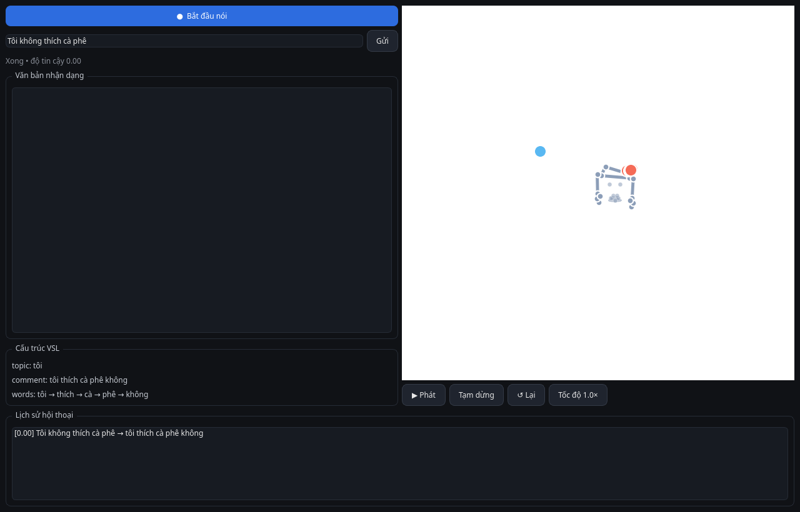
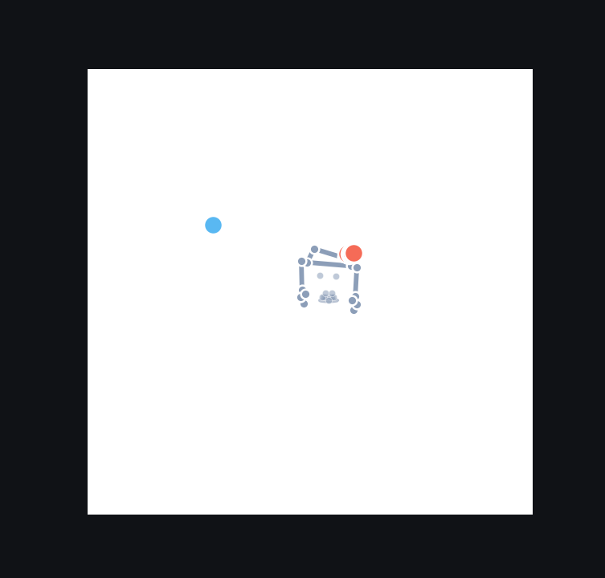

# Phần 2 — Speech → Sign qua Avatar 3D

Ứng dụng desktop chuyển lời nói tiếng Việt thành chuỗi ký hiệu VSL và
**phát hoạt hình avatar 3D** được sinh từ chính dữ liệu keypoint của dataset
(không cần asset ngoài).

```
Lời nói ──► Whisper (NCCL) ──► Text ──► Grammar Translator ──► [topic, comment, words]
                                                                     │
     User cũng có thể… gõ text ──────────────────────────────────────┘
                                                                     v
                                    Avatar 3D (keypoint-driven, matplotlib) ◄── animation_sequence
```

## Cài đặt / chạy

```bash
cd "$HOME/Documents/part2-speech-to-sign"

# giao diện đồ họa
"$HOME/Documents/venv/bin/python" -m frontend.main

# API server (port 8001)
"$HOME/Documents/venv/bin/python" -m backend.app
# hoặc: ../../venv/bin/uvicorn backend.app:app --port 8001
```

- Giao diện: màn hình **SpeechCapture** (nút ⏺ Ghi / ⏸ Dừng; có thể gõ text
  trực tiếp khi không có micro), bảng **VSL Structure** (topic/comment/bộ ký
  hiệu), **Avatar Viewport** (phát/dừng/tốc độ, `R` replay), và lịch sử.
- Model Whisper được tải lần đầu (~0.5–2 GB tùy kích cỡ); offline vẫn dùng
  được chức năng gõ text.

**Demo:**

| Ứng dụng Speech→Sign | Avatar 3D (keypoint) |
|----------------------|----------------------|
|  |  |

## Chạy test

```bash
cd "$HOME/Documents" && ./run_tests.sh          # toàn repo (104 tests)
# riêng phần này:
"$HOME/Documents/venv/bin/python" -m pytest part2-speech-to-sign -q
```

## Cấu trúc

```
part2-speech-to-sign/
├── backend/
│   ├── app.py                  # FastAPI 4 endpoints
│   ├── speech_recognition.py   # faster-whisper (lazy), STTResult
│   ├── grammar_translator.py   # tách cụm + quy tắc thì/phủ định + LLM tùy chọn
│   ├── avatar_controller.py    # resolve_sign / build_animation_sequence
│   ├── models.py               # Pydantic request/response
│   └── config.py
├── frontend/                   # PyQt6: main.py, recorder.py, pipeline.py
├── avatar/                     # renderer.py (matplotlib), view.py (viewport)
└── tests/
```

## Luồng sự kiện chính

1. Người dùng nhấn **Ghi** → micro thu WAV 16kHz → `process_audio`.
2. `STT` (faster-whisper `small`, tải trễ) cho text + `confidence`.
3. `translate_to_vsl(text)` → cấu trúc **VSL**: chủ đề + bình luận + danh sách
   ký hiệu (bỏ trợ từ như "là", "và"; thời → động từ; phủ định sau động từ,
   …).
4. `avatar_controller` ánh xạ từng ký hiệu sang clip keypoint `reference://sign`
   và sinh `animation_sequence` (word, duration, frames).
5. `AvatarViewport` phát lại; người dùng xem & replay.
6. Lịch sử lưu trong phiên (có thể mở rộng `vsl_data/vsl.db` nếu cần).

## Quyết định thiết kế

- **Keypoint-driven avatar**: không dùng file 3D/FBX; `reference_templates.npz`
  (3311 mẫu `(30,201)`) là thư viện hoạt hình.
- **LLM tùy chọn** (`VSL_LLM_ENABLED`, mặc định 0): tinh chỉnh câu qua Ollama;
  tắt thì grammar thuần quy tắc và vẫn hoạt động đầy đủ.
- **Whisper cục bộ**: không API ngoài, không gửi dữ liệu lên cloud.