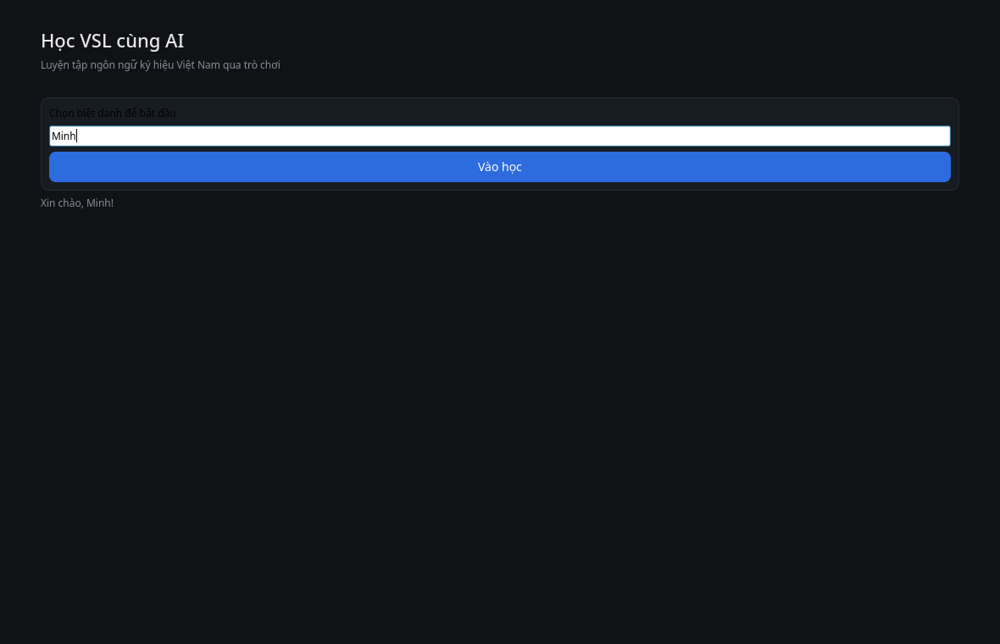
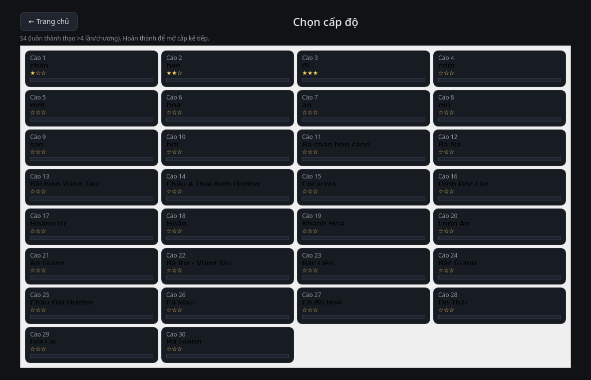
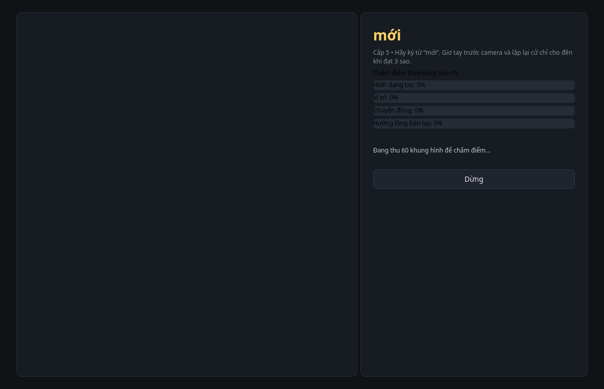
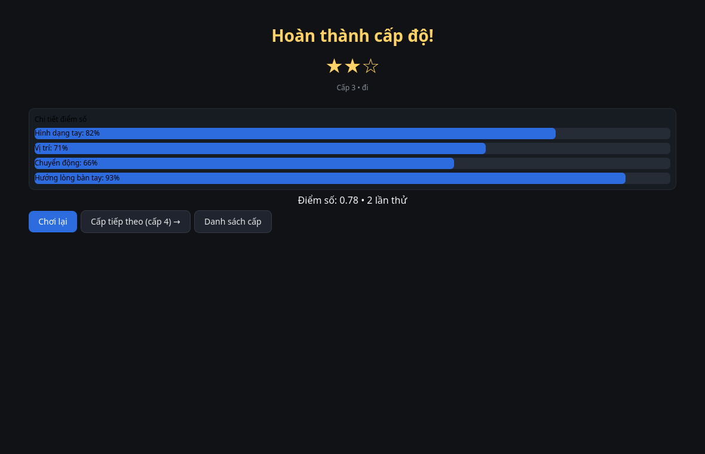
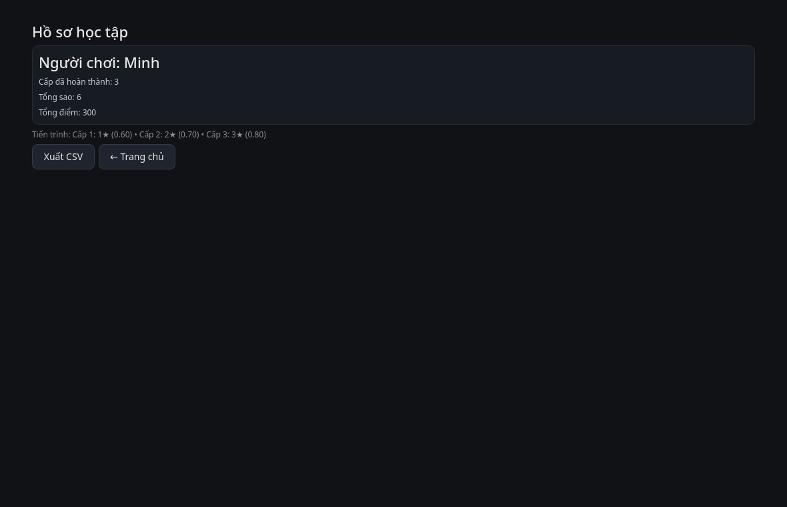

# Phần 3 — Gamification Học VSL qua Webcam

Ứng dụng desktop dạy ký hiệu VSL bằng **webcam**, chấm điểm thời gian thực theo
**4 tiêu chí** (hình dáng tay, vị trí, chuyển động, hướng lòng bàn tay) và điều
hướng theo **30 cấp độ** với hệ sao + điểm.

```
Webcam ─► MediaPipe (tay) ─► classify_live() ─► accuracy by 4 criteria
                                                   │
   Level N (từ vocabulary.json) ◄── level_is_unlocked   ▼
                                                   │
                                           feedback + stars (1-3) ─► profile/stats
```

## Cài đặt / chạy

```bash
cd "$HOME/Documents/part3-gamification"

# giao diện đồ họa
"$HOME/Documents/venv/bin/python" -m frontend.main

# API server (port 8002)
"$HOME/Documents/venv/bin/python" -m backend.app
# hoặc: ../../venv/bin/uvicorn backend.app:app --port 8002
```

## Màn hình

| Dashboard | Level Select | Gameplay |
|-----------|--------------|----------|
|  |  |  |

| Results | Profile |
|---------|---------|
|  |  |

1. **Dashboard** — tổng quan (level hiện tại, sao, điểm).
2. **Level Select** — lưới 30 cấp; cấp bị khóa hiển thị mờ + đk.
3. **Gameplay** — webcam đè khung xương MediaPipe; cửa sổ 60 khung tích lũy
   → kết quả 4 tiêu chí + gợi ý sửa.
4. **Results** — điểm từng tiêu chí, sao, feedback, nút Next/Replay.
5. **Profile** — tiến độ mọi level, tổng sao/điểm.

## Chạy test

```bash
cd "$HOME/Documents" && ./run_tests.sh          # toàn repo (89 tests)
# riêng phần này:
"$HOME/Documents/venv/bin/python" -m pytest part3-gamification -q
```

## Cấu trúc

```
part3-gamification/
├── backend/
│   ├── app.py              # FastAPI: start-session / submit-pose / complete-level / stats
│   ├── scoring_engine.py   # classify_live, score_sequence, 4 tiêu chí
│   ├── level_manager.py    # Level, level_for (30 cấp, is_unlocked, stars)
│   ├── feedback_generator.py
│   ├── user_manager.py     # đăng ký/nạp/tiến bộ (SQLite vsl_data/learners.db)
│   ├── pose_extractor.py   # MediaPipe → (21,3) bàn tay
│   ├── sign_classifier.py  # so khớp reference template (DTW) / model Part 1
│   └── models.py
├── frontend/
│   ├── main.py             # VSLApp (QStackedWidget)
│   ├── camera.py           # CameraWorker (thread + overlay draw_overlay)
│   ├── state.py            # GameSession
│   └── screens/            # dashboard, level_select, gameplay, results, profile
└── tests/
```

## Quyết định thiết kế

- **Điểm theo tham chiếu chung với Part 2** — cùng `reference_templates.npz`
  và `vocabulary.json`, nên ký hiệu game dạy luôn có sẵn hoạt hình avatar.
- **Không phụ thuộc model Part 1**: mặc định dùng Template/DTW backend
  (`classify_live`); khi có model `vsl_model.pt` thì ưu tiên nếu tự tin.
- **DB riêng** `vsl_data/learners.db`; test tự tách DB tạm qua `VSL_DB_PATH`.
- **feedback bằng tiếng Việt**, theo tiêu chí thấp nhất.